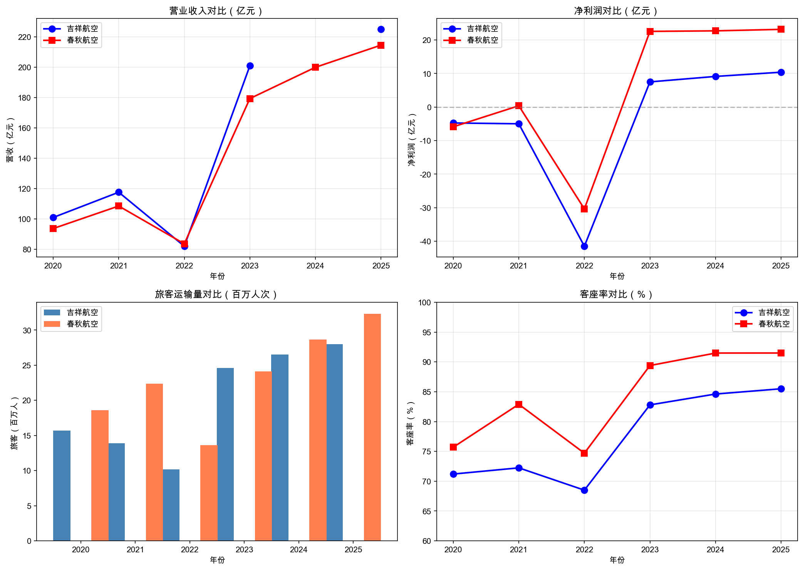
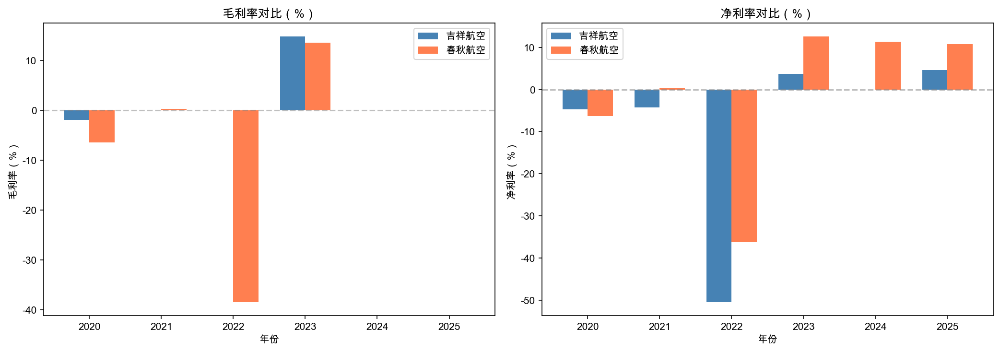
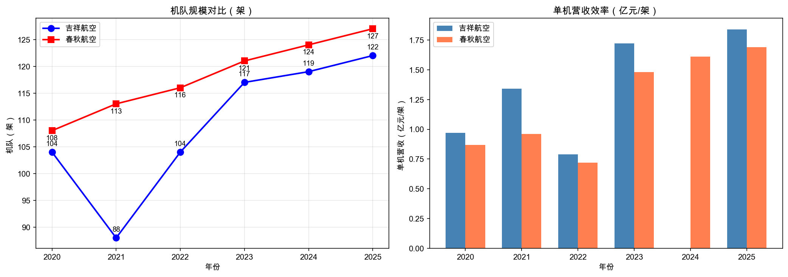
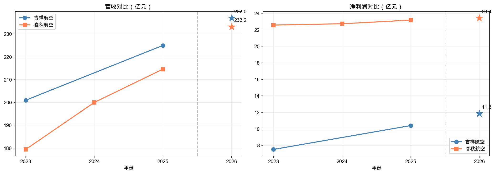

# 吉祥航空 vs 春秋航空 对比分析报告

**作者**：数字化办公室-AI
**日期**：2026-05-10
**数据来源**：`/Users/fox/DB/external_data.db` → `airline_annual_report` 表
**分析模型**：本地数据分析（图表+结构化报告）

---

## 执行摘要

吉祥航空与春秋航空作为国内两大民营航司，2023-2025年整体营收规模相当（200-225亿），但**盈利能力差距显著**：
- 春秋航空净利率保持在10%+，而吉祥航空仅4%左右
- 春秋航空客座率持续保持91%+，吉祥航空约85%
- 春秋净利润是吉祥的2倍以上

**核心结论**：春秋航空盈利能力显著强于吉祥航空，主要源于更高的客座率和成本控制能力。

---

## 一、营收规模与增长趋势

| 年份 | 吉祥航空 | 春秋航空 | 差异 |
|------|---------|---------|------|
| 2020 | 101.02亿 | 93.73亿 | +7.29亿 |
| 2021 | 117.67亿 | 108.58亿 | +9.09亿 |
| 2022 | 82.10亿 | 83.69亿 | -1.59亿 |
| 2023 | 200.96亿 | 179.40亿 | +21.56亿 |
| 2024 | — | 200.00亿 | — |
| 2025 | 224.99亿 | 214.60亿 | +10.39亿 |

**关键发现**：
- 2020-2022疫情三年，两者均受冲击，2022年营收跌至80亿左右
- 2023年疫后复苏，营收大幅反弹（吉祥+145%，春秋+114%）
- 2025年吉祥航空营收224.99亿，略高于春秋航空214.6亿
- 吉祥营收增长（25年YoY约+12%）略快于春秋（+7.3%）

---

## 二、盈利能力对比

### 2.1 净利润对比

| 年份 | 吉祥净利润 | 春秋净利润 | 差距 |
|------|----------|----------|------|
| 2023 | 7.51亿 | 22.57亿 | 春秋多15.06亿 |
| 2024 | 9.14亿 | 22.73亿 | 春秋多13.59亿 |
| 2025 | 10.40亿 | 23.17亿 | 春秋多12.77亿 |

### 2.2 净利率对比

| 年份 | 吉祥净利率 | 春秋净利率 | 差距 |
|------|----------|----------|------|
| 2023 | 3.74% | 12.58% | +8.84pp |
| 2024 | — | 11.36% | — |
| 2025 | 4.62% | 10.80% | +6.18pp |

**关键发现**：
- **净利润差距**：2025年春秋净利润23.17亿，是吉祥10.4亿的**2.2倍**
- **净利率差距**：春秋保持10%+，吉祥仅4-5%，差距约6-8个百分点
- **2026Q1**：春秋净利润9.83亿，大幅领先吉祥4.41亿

---

## 三、运营效率对比

### 3.1 旅客运输量

| 年份 | 吉祥旅客 | 春秋旅客 | 差距 |
|------|--------|--------|------|
| 2023 | 2463万 | 2413万 | 吉祥多50万 |
| 2024 | 2650万 | 2868万 | 春秋多218万 |
| 2025 | 2800万 | 3234万 | 春秋多434万 |

### 3.2 客座率

| 年份 | 吉祥客座率 | 春秋客座率 | 差距 |
|------|----------|----------|------|
| 2023 | 82.8% | 89.4% | +6.6pp |
| 2024 | 84.62% | 91.49% | +6.87pp |
| 2025 | 85.5% | 91.5% | +6.0pp |

**关键发现**：
- **旅客运输量**：春秋航空2025年3234万，比吉祥2800万多15%
- **客座率**：春秋保持91%+，吉祥约85%，差距6-7个百分点
- **趋势**：2024年起春秋在旅客量上实现超越并持续扩大

---

## 四、机队规模与发展

| 年份 | 吉祥机队 | 春秋机队 |
|------|--------|--------|
| 2020 | 104架 | 108架 |
| 2021 | 88架 | 113架 |
| 2022 | 104架 | 116架 |
| 2023 | 117架 | 121架 |
| 2024 | 119架 | 124架 |
| 2025 | 122架 | 127架 |

两者机队规模相当，2025年均在120+架，春秋机队略大（多5架）。

---

## 五、综合评价

| 指标 | 吉祥航空 | 春秋航空 | 优势方 |
|------|--------|--------|------|
| 营收规模（2025） | 224.99亿 | 214.60亿 | 吉祥 |
| 净利润（2025） | 10.4亿 | 23.17亿 | **春秋** |
| 净利率（2025） | 4.62% | 10.80% | **春秋** |
| 旅客运输量（2025） | 2800万 | 3234万 | **春秋** |
| 客座率（2025） | 85.5% | 91.5% | **春秋** |
| 机队规模（2025） | 122架 | 127架 | 春秋 |

**核心结论**：
1. **春秋航空盈利能力显著更强**：净利率是吉祥的2.3倍
2. **春秋运营效率更高**：客座率91.5% vs 85.5%，单位产能更高
3. **吉祥营收增长略快**，但增收不增利，成本控制能力弱于春秋
4. 2026Q1趋势：春秋净利润增速远超吉祥

---

## 六、建议与风险

| 类型 | 内容 | 影响 |
|------|------|------|
| 机会（春秋） | 保持高客座率优势，扩大市场份额 | 高 |
| 机会（春秋） | 净利率10%+，成本管控能力验证 | 中 |
| 风险（吉祥） | 净利率仅4.6%，航油成本占比高时利润承压 | 高 |
| 风险（吉祥） | 客座率85.5% vs 春秋91.5%，效率差距需缩小 | 中 |
| 建议（吉祥） | 提升定价能力或优化航线结构 | 中 |

---

**图表说明**：
- 图1：营收与净利润趋势（2020-2025）
- 图2：毛利率与净利率对比
- 图3：机队规模与单机营收效率

---

## 七、2026年利润预测（线性回归）

| 指标 | 吉祥航空 | 春秋航空 |
|------|---------|---------|
| 预测营收 | 237.0亿 | 233.2亿 |
| 预测净利润 | 11.8亿 | 23.4亿 |
| 预测净利率 | 5.06% | 9.80% |

**预测说明**：
- 基于2023-2025年历史数据线性回归预测
- 吉祥净利润预测值约11.8亿，春秋约23.4亿
- 春秋净利润仍保持吉祥的**2倍**左右
- 趋势：两家公司营收差距缩小，盈利差距持续

---

**报告信息**
- 数据来源：`/Users/fox/DB/external_data.db` → `airline_annual_report`
- 原始数据：SQLite 数据库直接查询
- 分析日期：2026-05-10